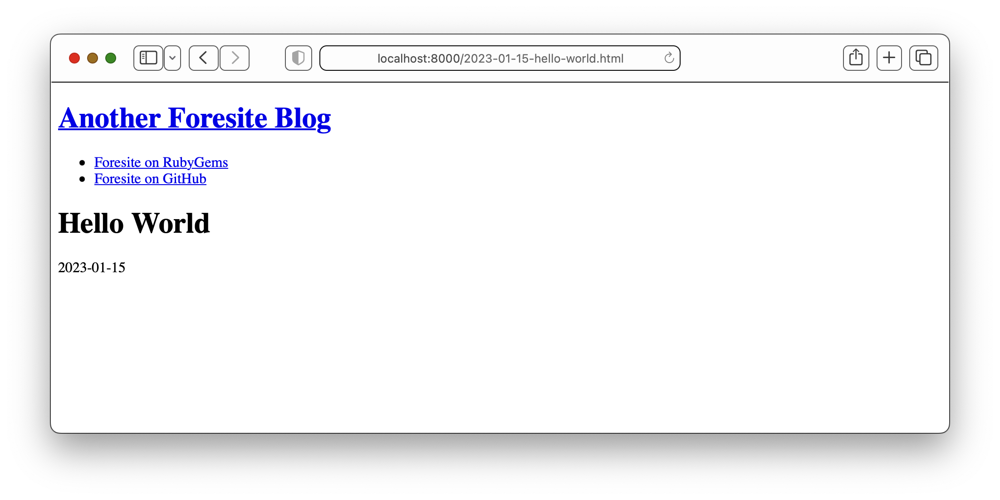

# Foresite

An extremely minimal static site generator.

CLI executable that converts markdown wrapped in a single template to static HTML for simple blogs hosted on [GitHub Pages](https://pages.github.com/) or similar.

## Installation

The only requirement is Ruby >= 2.7.0.

    $ gem install foresite

## Quick start: Hello World

    $ mkdir my_blog                 # Create a project directory

    $ cd my_blog

    $ foresite init                 # Initialize

    $ foresite touch "Hello World"  # Create markdown post titled "Hello World"

    $ foresite build                # Converts markdown to HTML



## Getting started guide

### 1. Create your project directory

Create a project directory for your site and run `foresite init` from within it:

    $ mkdir my_blog

    $ cd my_blog

    $ foresite init
    Created md/
    Created post/
    Created erb/
    Created erb/post.md.erb
    Created erb/wrapper.html.erb
    Created erb/_list.html.erb

Three subdirectories are created, along with three [ERB](https://docs.ruby-lang.org/en/3.2/ERB.html) template files.

Some facts:

* `md` subdirectory will contain markdown files known as posts, which are your site's content.
* `post` subdirectory will contain HTML files generated from the markdown posts with the exception of an `index.html` file listing all posts, which will exist in the top-level project directory.
* `erb` subdirectory contains [ERB](https://docs.ruby-lang.org/en/3.2/ERB.html) templates you can modify:
  * `post.md.erb` is the default markdown file for every post.
  * `wrapper.html.erb` is a HTML wrapper template for every generated HTML file.
  * `_list.html.erb` is a HTML template partial for the list of posts on the `index.html` page.

### 2. Write your first post

Run `foresite touch` to generate a new post in the `md` subdirectory. The title is its sole argument.

    $ foresite touch "Welcome to my site"
    Created md/2023-01-15-welcome-to-my-site.md

    $ cat md/2023-01-15-welcome-to-my-site.md
    # Welcome to my site
    
    2023-01-15

A single markdown file is created in the `md` subdirectory. **This file is meant for you to edit.**

Some facts:

* The title is the first line formatted as H1 (mandatory).
* Current date in YYYY-MM-DD format is the first markdown paragraph (optional).
* Current date and title are "slugified" for filename.

### 3. Modify templates as desired

`post.md.erb` is used to when running `foresite touch` for the default markdown content. It has two variables, `@title` for the post title and `@date_ymd` for the created date in ISO 8601 `YYYY-MM-DD` format. Modify to have different defaults when running `foresite touch`.

`wrapper.html.erb` wraps all of your markdown. Its sole variable `@content` will be a given post's HTML (converted from markdown). For the `index.html` file, `@content` will be an list of links to all posts in reverse-chronological order. Modify to have different overall page structure, or to add `<style>` etc.

`_list.html.erb` is used to generate the `<ul>` list of posts on the `index.html` file. Modify to show posts in a different way.

### 4. Generate HTML from markdown

Run `foresite build` to create HTML in the `post` subdirectory and the `index.html` file:

    $ foresite build
    Created post/2023-01-15-welcome-to-my-site.html
    Created index.html

In this example, two HTML files are created.

Some facts:

* For every post markdown file in the `md` subdirectory an equivalent HTML file is generated in the `post` subdirectory, each wrapped with wrapper template markup.
* A single `index.html` file shows a list of links to all posts in reverse-chronological order, prefixed with post date.
  * Post titles are parsed from the first H1 tag in each post markdown file.
  * Post dates are parsed from the post markdown filename.
* Re-running `foresite build` removes and recreates all HTML files in the `post` subdirectory as well as the `index.html` file.

In this example, the `index.html` will contain:

```html
<ul>
  <li>2023-01-15 <a href="post/2023-01-15-welcome-to-my-site.html">Welcome to my site</a></li>
</ul>
```

## Development

1. Clone
2. `bundle` to install dependencies
3. `bundle exec rake` to run tests & linter

To install this gem from local source, run `bundle exec rake install:local`.

## Contributing

Bug reports and pull requests are welcome. The goals of Foresite are:

* Extremely lightweight
* Simple to use & understand
* Minimal features

Read more in the [blog post introducing Foresite](https://carlwiedemann.github.io/post/2023-01-17-introducing-foresite.html)

## License

The gem is available as open source under the terms of the [MIT License](https://opensource.org/licenses/MIT).
